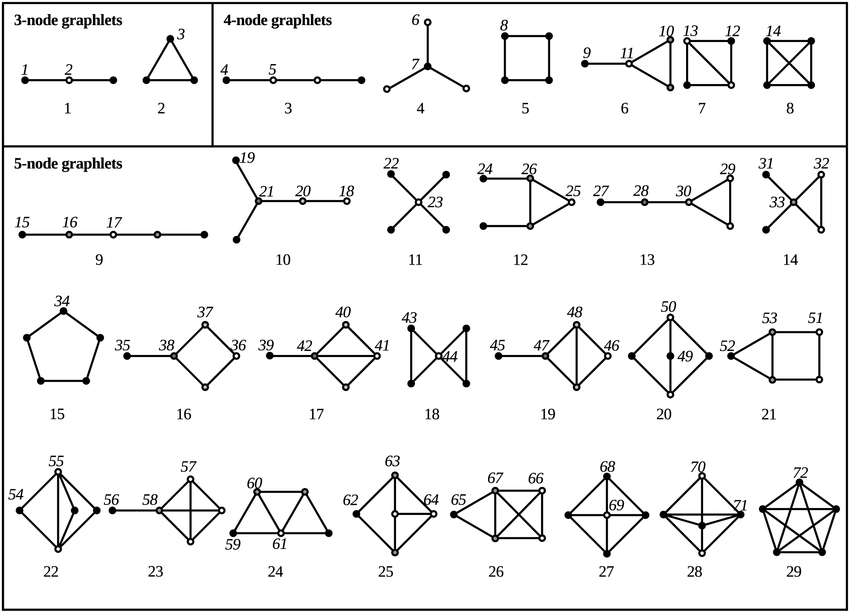
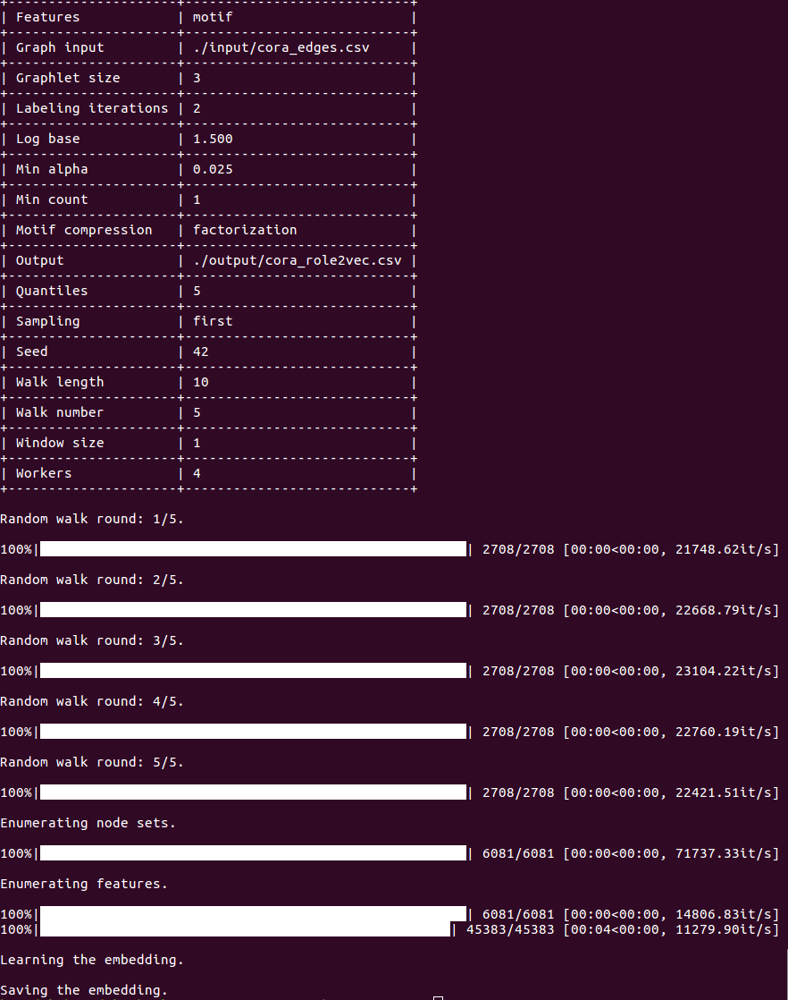

Role2Vec
============================================
[](https://arxiv.org/abs/1802.02896) [](https://codebeat.co/projects/github-com-benedekrozemberczki-role2vec-master) [](https://github.com/benedekrozemberczki/role2vec/archive/master.zip)⠀[](https://twitter.com/intent/follow?screen_name=benrozemberczki)⠀


A scalable parallel **gensim** implementation of **Learning Role-based Graph Embeddings (IJCAI 2018)**.
<p align="center">
  
</p>


--------------------------------------------------------------------------------


### Abstract

<p align="justify">
Random walks are at the heart of many existing network embedding methods. However, such algorithms have many limitations that arise from the use of random walks, e.g., the features resulting from these methods are unable to transfer to new nodes and graphs as they are tied to vertex identity. In this work, we introduce the Role2Vec framework which uses the flexible notion of attributed random walks, and serves as a basis for generalizing existing methods such as DeepWalk, node2vec, and many others that leverage random walks. Our proposed framework enables these methods to be more widely applicable for both transductive and inductive learning as well as for use on graphs with attributes (if available). This is achieved by learning functions that generalize to new nodes and graphs. We show that our proposed framework is effective with an average AUC improvement of 16.55% while requiring on average 853x less space than existing methods on a variety of graphs.

The second-order random walk sampling methods were taken from the reference implementation of [Node2vec](https://github.com/aditya-grover/node2vec). </p>

The model is now also available in the package [Karate Club](https://github.com/benedekrozemberczki/karateclub).

This repository provides an implementation of Role2Vec as described in the paper:

> Learning Role-based Graph Embeddings.
> Nesreen K. Ahmed, Ryan Rossi, John Boaz Lee, Theodore L. Willke, Rong Zhou, Xiangnan Kong, Hoda Eldardiry.
> StarAI workshop - IJCAI, 2018.
> [[Paper]](https://arxiv.org/abs/1802.02896)

### Requirements

The codebase is implemented in Python 3.5.2. package versions used for development are just below.
```
networkx          2.4
tqdm              4.28.1
numpy             1.15.4
pandas            0.23.4
texttable         1.5.0
scipy             1.1.0
argparse          1.1.0
gensim            3.6.0
scikit-learn      0.20.0
```
### Datasets
<p align="justify">
The code takes the **edge list** of the graph in a csv file. Every row indicates an edge between two nodes separated by a comma. The first row is a header. Nodes should be indexed starting with 0. A sample graph for `Cora` is included in the  `input/` directory. </p>
<p align="justify">
Training the model is handled by the `src/main.py` script which provides the following command line arguments.</p>

#### Input and output options
```
  --graph-input      STR   Input graph path.   Default is `input/cora_edges.csv`.
  --output           STR   Embeddings path.    Default is `output/cora_role2vec.csv`.
```
#### Random walk options
```
  --window-size      INT    Skip-gram window size.        Default is 5.
  --walk-number      INT    Number of walks per node.     Default is 10.
  --walk-length      INT    Number of nodes in walk.      Default is 80.
  --sampling         STR    Sampling procedure.           Default is `first`.
  --P                FLOAT  Return parameter.             Default is 1.0.
  --Q                FLOAT  In-out parameter.             Default is 1.0.
```
#### Factorization options
```
  --dimensions      INT      Number of dimensions.      Default is 128
  --down-sampling   FLOAT    Down sampling frequency.   Default is 0.001.
  --alpha           FLOAT    Initial learning rate.     Default is 0.025.
  --min-alpha       FLOAT    Final learning rate.       Default is 0.025.
  --min-count       INT      Minimal feature count.     Default is 1
  --workers         INT      Number of cores.           Default is 4.
  --epochs          INT      Number of epochs.          Default is 10.
```

#### Feature creation options

```
  --features               STR     Feature extraction mechanism.         Default is `wl`.
  --labeling-iterations    INT     Number of WL labeling iterations.     Default is 2.
  --log-base               FLOAT   Log base for label creation.          Default is 1.5.
  --graphlet-size          INT     Maximal graphlet size.                Default is 4.
  --quantiles              INT     Number of quantiles for binning.      Default is 5.
  --motif-compression      STR     Motif compression procedure.          Default is `string`.
  --seed                   INT     Sklearn random seed.                  Default is 42.
  --factors                INT     Factors for motif compression.        Default is 8.
  --clusters               INT     Number of motif based labels.         Default is 50.
  --beta                   FLOAT   Motif compression regularizer.        Default is 0.01.
```

### Examples
<p align="justify">
The following commands learn a Role2Vec embedding. The first example trains an embedding based on the default dataset with standard hyperparameter settings.  The script saves the embedding at the default path.</p>
```
python src/main.py
```
<p align="center">

</p>

Using the degree centrality as a structural feature.
```
python src/main.py --features degree
```
Using the Weisfeiler-Lehman labeling as a structural feature.
```
python src/main.py --features wl
```
Using motif based structural features with factorization compression.
```
python src/main.py --features motif --motif-compression factorization
```
Using motif based structural features with factorization compression and a structural label number of 40.
```
python src/main.py --features motif --motif-compression factorization --clusters 40
```
Using a custom factorization dimension for the embedding.
```
python src/main.py --dimensions 32
```
Using second-order attributed ranom walks for sampling.
```
python src/main.py --sampling second --P 1 --Q 4
```


--------------------------------------------------------------------------------

**License**

- [GNU](https://github.com/benedekrozemberczki/Role2Vec/blob/master/LICENSE)

--------------------------------------------------------------------------------
